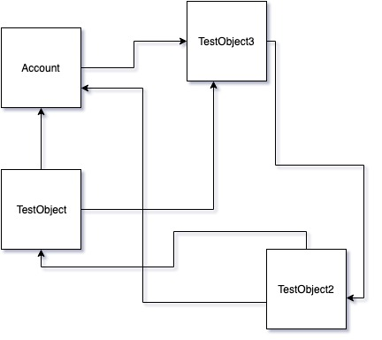

# The Salesforce Data Loader SFDX Plugin (SFDX Data Move Utility)


**The documentation can be found here:   [SFDMU Help Center](https://help.sfdmu.com/)**

**The GUI Desktop Application is here:  [SFDMU GUI Desktop App](https://github.com/forcedotcom/SFDX-Data-Move-Utility-Desktop-App)**

**Please, see our [Support Policy](https://help.sfdmu.com/full-documentation/additional-information/support_policy) before opening cases**

**Aways welcome to contribute to the SFDMU! Please, take some time to read our [Contribution Policy](https://help.sfdmu.com/full-documentation/additional-information/code_contribution_policy)** 

---
## Table of contents
- [Introduction:](#introduction)
- [The Advantages of the SFDMU:](#the-advantages-of-the-sfdmu)
- [Use case.](#use-case)
- [Watch the demo. The Plugin in action.](#watch-the-demo-the-plugin-in-action)
- [Installation of the Plugin.](#installation-of-the-plugin)
- [Configuring the migration job.](#configuring-the-migration-job)
- [Running the migration job.](#running-the-migration-job)
## Introduction:

**The SFDMU, Salesforce Data Loader SFDX Plugin (SFDX Data Move Utility) - is the powerful salesforce data migration tool and it is the innovative and very handy alternative to the traditional Salesforce Data Loader application as well as to the set of the force:data:tree commands.** 

✔ This SFDX Plugin will help you to populate your org **(scratch / dev / sandbox / production)** with data imported from another org or CSV files.<br /> 
✔ It supports all important CRUD operations (**Insert** / **Update** / **Upsert** / **Delete**)  **also for multiple related sObjects**.<br />
✔ It includes a huge amount of advanced features never were before in any of the existing tools, which make your data migration very quick and easy.<br />
✔ It's a SFDX-CLI digitally signed Plugin.
<br />
## The Advantages of the SFDMU:

*   Supports **direct Org-to-Org data migration** without having to deal with annoying intermediate CSV files.
*   Full support of CRUD operations: **Insert** / **Update** / **Upsert** / **Delete.**
*   Supports **import and export of CSV files**.
*   Supports **multiple object sets** allowing you to execute **multiple migration jobs in one run**.
*   Supports **simultaneous migration** **of multiple SObjects in one run.**.
*   Handles **complex circular references between multiple SObjects.**
*   **Simple and user-friendly configuration** just with a [single export.json file](https://help.sfdmu.com/full-documentation/configuration-and-running/full-exportjson-format)
*   **Can be run from a command line, can be easly integrated into any DevOps pipeline.**
*   Handles **self-referenced fields**, e.g. Account.ParentId.
*   Supports **External Id field of any type** even formula and auto-name fields, a field does not need to be defined as External Id.
*   Supports [**composite external Id keys.**](https://help.sfdmu.com/full-documentation/advanced-features/composite-external-id-keys)
*   Supports data [**migration preserving Record Type**](https://help.sfdmu.com/full-documentation/advanced-features/handling-record-type) for each record.
*   Supports [**fully** **customized Fields and Object Mapping**](https://help.sfdmu.com/full-documentation/advanced-features/fields-mapping).
*   Has the **built-in ETL features,** including [**customized Value Mapping**](https://help.sfdmu.com/full-documentation/advanced-features/values-mapping), [**expression-based records transformation**](https://help.sfdmu.com/full-documentation/add-on-api/records-transform-core-add-on-module).
*   Supports migration of **Person Accounts,** including **mixed account records of Busines and Person type**.
*   Supports **migration of** [**Salesforce Files**](https://help.sfdmu.com/full-documentation/add-on-api/export-file-core-add-on-module) as well as old-fashioned [**Notes** , **Attachments**](https://help.sfdmu.com/full-documentation/advanced-features/export-attachments-and-files), **including file binary data**.
*   Supports **record owner assignment,** including **option for a default owner assignment.**
*   Has the [**built-in** **data anonymization feature**](https://help.sfdmu.com/full-documentation/advanced-features/data-anonymization) to anonymize a  sensitive source data (e.g. coming from Production org).
*   Supports binding of [**polymorphic lookup fields**](https://help.sfdmu.com/full-documentation/advanced-features/polymorphic-lookup-fields) (e.g. FeedItem.ParentId).
*   **Secured and safe**. All operations are performed on the client's machine, there is no cloud interaction, so all is completely safe.
*   **Fast performance.** Processes only a selected subset of records and fields that need to be inserted or updated and does not touch others.
*   **The core functionality can be extended by using the [Custom Add-On Api](https://help.sfdmu.com/full-documentation/add-on-api/custom-sfdmu-add-on-api)**. You can create your own Add-On for your special purposes.

## Use case.

Creating of a scratch org, dev org or even a sandbox today is a pretty fast and simple action. On the other hand the newly created organization has only metadata ready-to-use, has no real data that is always strongly required to develop and debug any Salesforce application. It makes no sense to manually create or load data traditional way (with the Salesforce Data Loader) for each new org because the data easily can be taken in whole or in part from  production or from the sandbox and imported into the new organization. 

In some cases we already have the data, but it's only required to modify particular records or even fields without touching others. When a date model is complex and contains a large number of dependencies, it becomes a very hard and annoying task. 

Also there is a situation when as client you would like to keep the data model clean without creating external ID fields in the SObject, therefore your goal is to find some workaround to update records in your developer org from the existing source without adding new fields. 

Population of the RecordtypeId field is another quite difficult task, when ids are not consistent between environment.

At current moment, there is no effective tool for both inserting and updating dependent objects based on any unique field used as External Id.  In most cases people use Excel spreadsheets to build source tables and try to mix between them to get proper values for the lookup or master-detail fields. So filling out even a small number of objects turns into a huge pain...

## Watch the demo. The Plugin in action.

Running the Plugin from the command console / terminal:

[](https://www.youtube.com/watch?v=KI_1vD93prA)


## Installation of the Plugin.

### Prerequisites.

Before using the SFDMU you need to perform the usual procedure of installing SFDX CLI on your computer from here:

```bash
https://developer.salesforce.com/docs/atlas.en-us.sfdx_setup.meta/sfdx_setup/sfdx_setup_install_cli.htm
```

### Installation of the SFDMU as a standard SFDX plugin:

```bash
# If you have an old version of the Plugin, uninstall it:
$ sfdx plugins:uninstall sfdmu

# Install the latest version of the Plugin:
$ sfdx plugins:install sfdmu
```

### Installation with the SFDMU source code:

```bash
# If you have outdated source code already cloned and linked, go to the directory containing old Plugin source code and unlink it from the SFDX by typing:
$ sfdx plugins:unlink

# Clone the source code:
$ git clone https://github.com/forcedotcom/SFDX-Data-Move-Utility

# Make the installation directory current:
$ cd SFDX-Data-Move-Utility

# Install npm modules:
$ npm install

# Link the Plugin to the SFDX:
$ sfdx plugins:link
```


## Configuring the migration job.

### Example of basic configuration: upserting Accounts.

Create a new **export.json** file with the following format:


```json
{
    "objects": [
        {
            "query": "SELECT Id, Name FROM Account",
            "operation": "Upsert",
            "externalId": "Name"
        }
    ]
}
```

<br />

### Example of advanced configuration: upserting multiple related SObjects.

Assume you have the following data model **with complex circular relationships** between SObjects:



Let's say, each record has unique Name value, so you want to use Name field as an External Id field for all SObjects in that data model.

You can Upsert all records preserving relationships between SObjects by creating an **export.json** file with the following format:

```json
{
    "objects": [
        {
            "query": "SELECT Id, Phone, TestObject3__c FROM Account WHERE Name LIKE 'TEST_ACC_%'",
            "operation": "Upsert",
            "externalId": "Name"
        },
        {
            "query": "SELECT Id, Account__c, TestObject3__c, RecordTypeId FROM TestObject__c",
            "operation": "Upsert",
            "externalId": "Name"
        },
        {
            "query": "SELECT Id, Account__c, TestObject__c FROM TestObject2__c",
            "operation": "Upsert",
            "externalId": "Name"
        },
        {
            "query": "SELECT Id, TestObject2__c FROM TestObject3__c",
            "operation": "Upsert",
            "externalId": "Name"
        }
    ]
}
```

## Running the migration job.

- Go to the directory where your **export.json** is located.

- Use the following command to run a direct migration between source and target salesforce orgs:

```bash
$ sfdx sfdmu:run --sourceusername source@name.com --targetusername target@name.com
```

- For import data from CSV files:

```bash
$ sfdx sfdmu:run --sourceusername csvfile --targetusername target@name.com
```

- For export data into CSV files:

```bash
$ sfdx sfdmu:run --sourceusername source@name.com --targetusername csvfile
```

<br />


----

See the documentation articles:

- [Quick Start with the SFDMU](https://help.sfdmu.com/quick-start)
- [Installation of the Plugin](https://help.sfdmu.com/plugin-basics/basic-usage/installation)
- [Minimal SFDMU configuration](https://help.sfdmu.com/plugin-basics/basic-usage/minimal-configuration)
- [Full export.json format](https://help.sfdmu.com/full-documentation/configuration-and-running/full-exportjson-format)
- [Running the migration job](https://help.sfdmu.com/plugin-basics/basic-usage/running)
- [Debugging of the SFDMU source code](https://help.sfdmu.com/plugin-basics/basic-usage/debugging)

